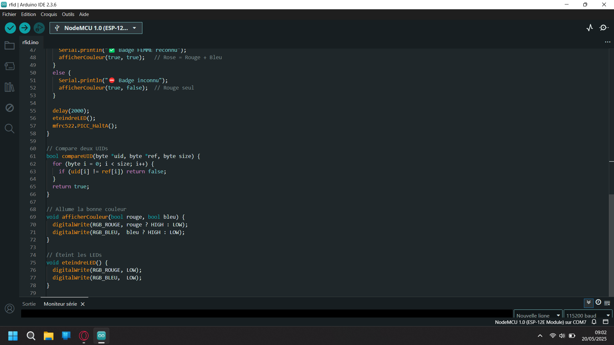

# 🏋️‍♂️ GymTech-RFID

**GymTech-RFID** est un système de contrôle d'accès basé sur RFID, conçu pour notre Projet Scolaire il permet detecter si le badge servira à ouvrir le vestiaires des Hommes ou les vestiaires des Femmes.
Il utilise un lecteur RFID RC522 un microcontrôleur ESP8266 et une LED RGB pour indiquer visuellement l'autorisation d'accès en fonction de l'UID du badge présenté.

## 🎥 Visualisation

<div style="text-align: center;">

</div>

---

## ✨ Fonctionnalités

- **Lecture d'UID** : Détecte les badges RFID et lit leur UID.
- **Indication visuelle** : Utilise une LED RGB pour indiquer l'état d'accès :
  - 🔵 **Bleu** : Accès autorisé au vestaire des Hommes `<votre UID n°1>`.
  - 🟣 **Rose** : Accès autorisé au vestaire des Femmes `<votre UID n°2>`.
  - 🔴 **Rouge** : Accès refusé pour tout autre UID.
- **Affichage série** : Affiche l'UID détecté et l'état d'accès dans le moniteur série.

---

## 🧰 Matériel requis

- [ESP8266 NodeMCU](https://www.nodemcu.com/index_en.html)
- [Lecteur RFID RC522](https://fr.wikipedia.org/wiki/MFRC522)
- [LED RGB à cathode commune](https://fr.wikipedia.org/wiki/LED_RGB)
- Résistances de 220 Ω à 330 Ω
- Câbles de connexion
- Breadboard (Platine d'essai)

---

## 🔌 Schéma de branchement

### 1. Lecteur RFID RC522

| Broche RC522 | Fonction        | ESP8266 Pin | GPIO   |
|--------------|-----------------|-------------|--------|
| SDA / NSS    | Slave Select    | D4          | GPIO2  |
| SCK          | Horloge SPI     | D5          | GPIO14 |
| MOSI         | Données (sortie)| D7          | GPIO13 |
| MISO         | Données (entrée)| D6          | GPIO12 |
| RST          | Reset           | D3          | GPIO0  |
| VCC          | Alimentation    | 3.3V        | -      |
| GND          | Masse           | GND         | -      |
| IRQ          | Interruption    | Non connecté| -      |

### 2. LED RGB (cathode commune)

| Couleur | Broche LED | ESP8266 Pin | GPIO   |
|---------|------------|-------------|--------|
| Rouge   | R          | D0          | GPIO16 |
| Bleu    | B          | D8          | GPIO15 |
| Vert    | G          | Non utilisé | -      |
| Cathode | -          | GND         | -      |

> 💡 N'oubliez pas d'ajouter une résistance entre chaque anode (R/B) et sa broche GPIO.

---

## 🛠️ Installation

1. **Cloner le dépôt** :

```bash
git clone https://github.com/enzo-mensier/GymTech-RFID.git
```

2. **Ouvrir le projet** :

- Ouvrez `rfid.ino` dans l’IDE Arduino.

3. **Installer les bibliothèques nécessaires** :

- `MFRC522`
- `SPI` (déjà installé dans le microcontrôleur)
- `esp8266`

> 📦 Installez-les via le **Gestionnaire de bibliothèques** dans l’IDE Arduino.

4. **Configurer la carte** :

- `Outils > Type de carte` → `NodeMCU 1.0 (ESP-12E Module)`
- `Outils > Ports` → `COM<votre_port>`

5. **Téléverser le code** :

- Connectez l’ESP8266 en USB.
- Cliquez sur **Téléverser**.

---

## 🚦 Comportement du système

| UID détecté        | Couleur de la LED RGB   | Affichage série              |
|--------------------|-------------------------|------------------------------|
| `<votre UID n°1>`  | 🔵 Bleu                | ✅ Badge BLEU reconnu        |
| `<votre UID n°2>`  | 🟣 Rose                | ✅ Badge ROSE reconnu        |
| Autre UID          | 🔴 Rouge               | ⛔ UID inconnu → ROUGE       |

---

## 📁 Structure du projet

```
GymTech-RFID/
├── rfid.ino
└── README.md
```

---

## 📄 Licence

Ce projet est sous licence MIT. Voir le fichier [LICENSE](LICENSE) pour plus d'informations.

---

## 🤝 Contribuer

Les contributions sont les bienvenues !

1. Forkez ce dépôt
2. Créez une branche : `git checkout -b feature/NouvelleFonctionnalite`
3. Commitez vos modifications : `git commit -am 'Ajout fonctionnalité'`
4. Poussez la branche : `git push origin feature/NouvelleFonctionnalite`
5. Créez une Pull Request

---

## 📬 Contact

Développé par [Enzo Mensier](https://github.com/enzo-mensier)  
🌐 Portfolio : [mensierenzo.netlify.app](https://mensierenzo.netlify.app)
